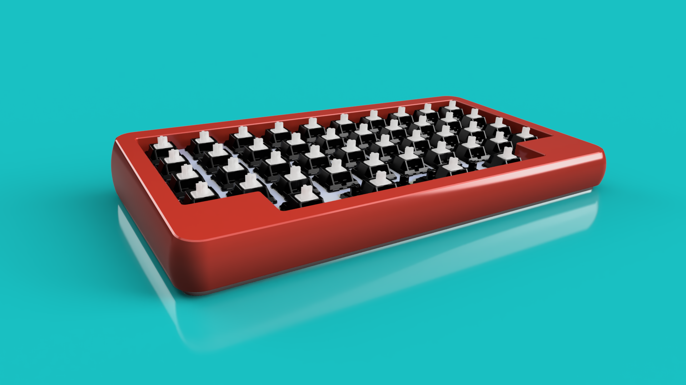
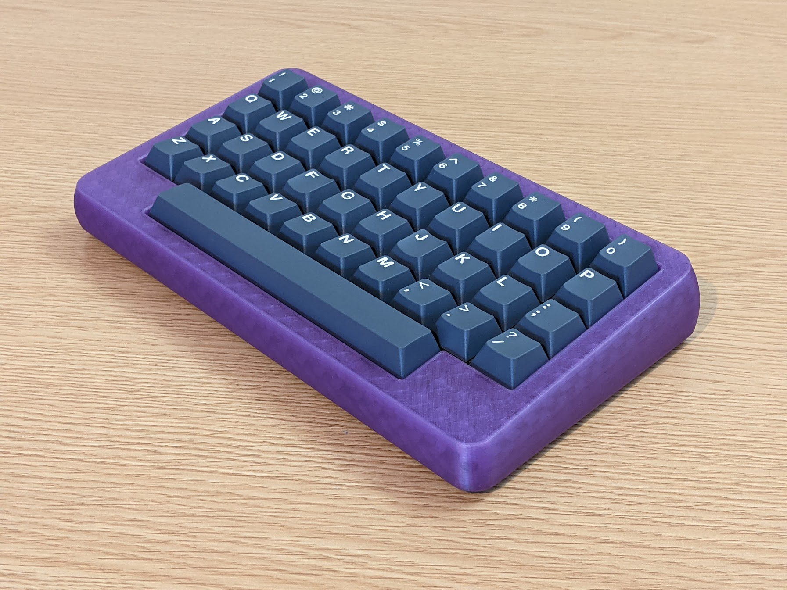

# Petit Peton
## :construction: This is a work in progress, some files are subjet to change. :construction: 

A 3D printable case for [The Little_Foot Keyboard](https://github.com/The-Royal/The_Royal_Open-Source-Projects/tree/master/01%20-%20Complete%20Kits/The_Little_Foot-Keyboard-rev2.3) PCB

