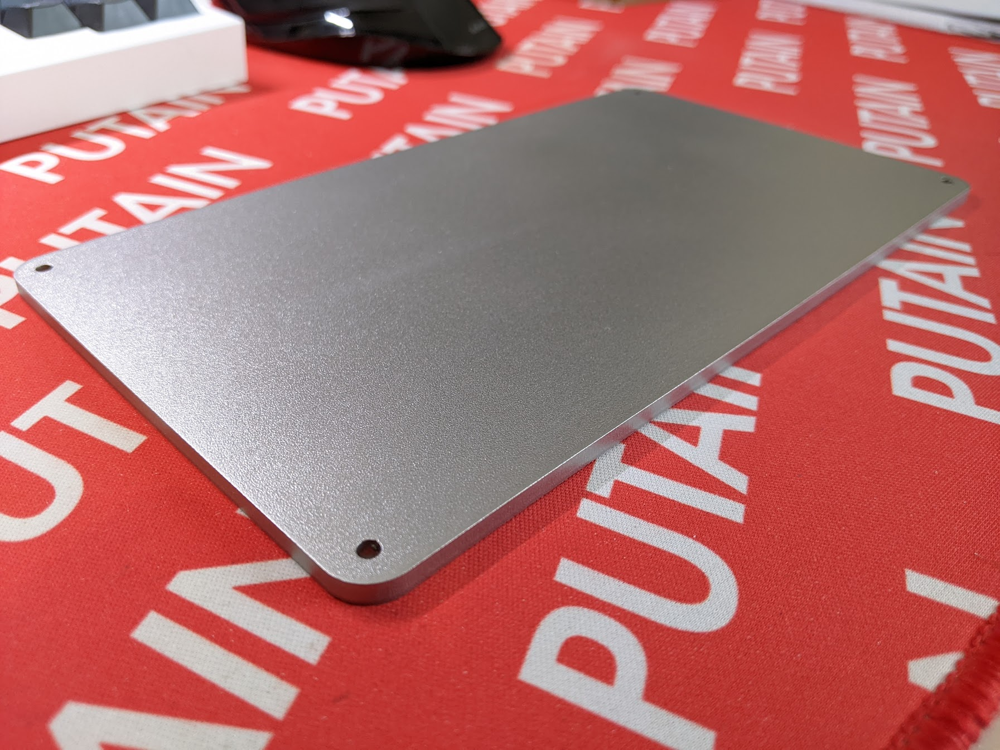
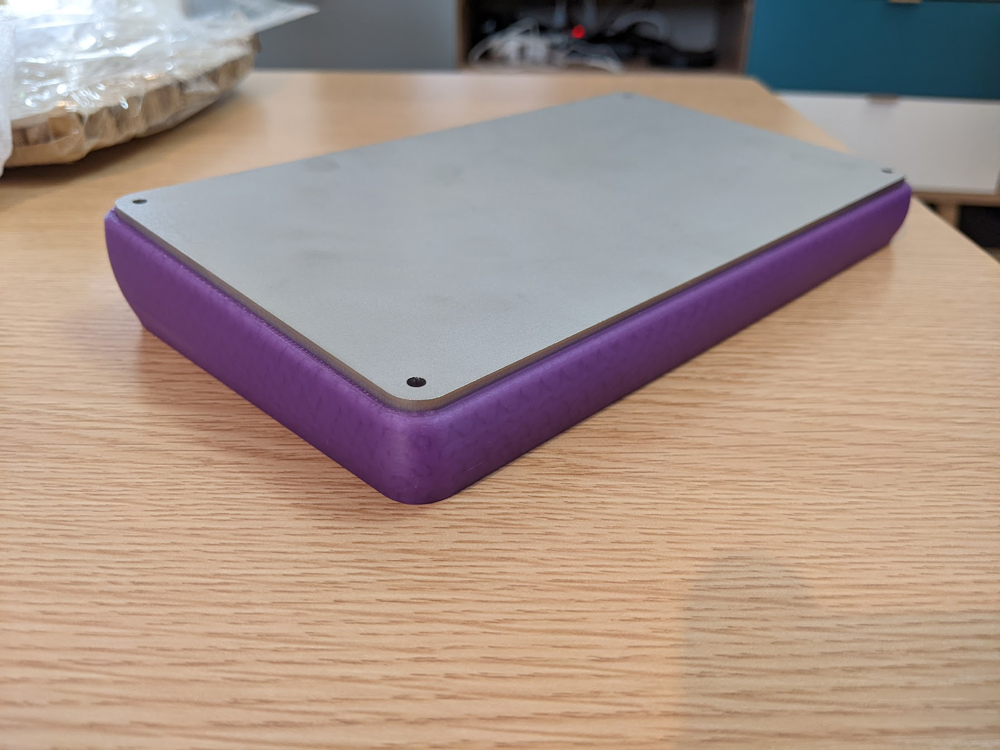
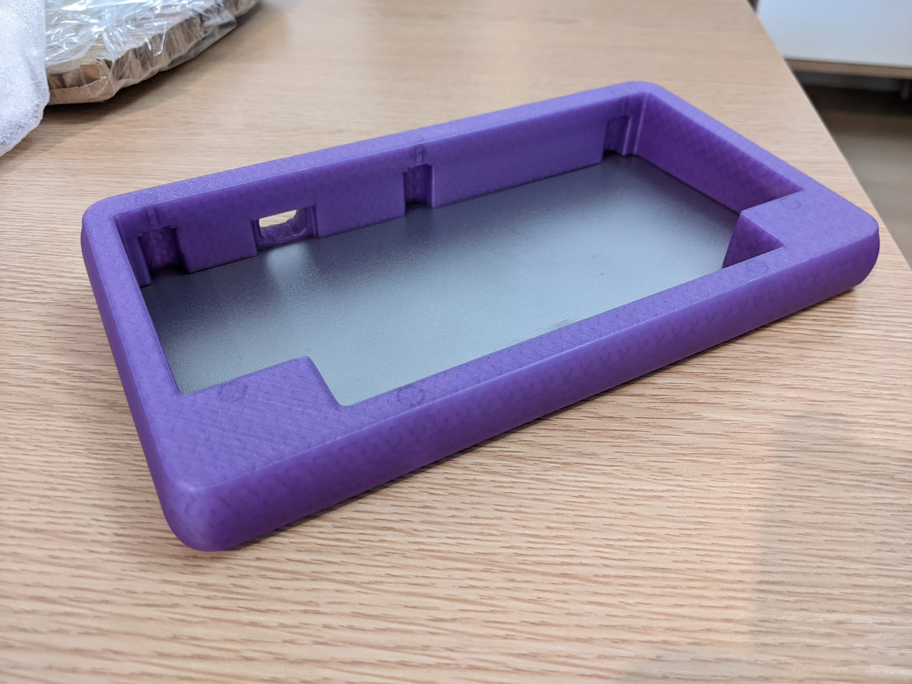

# Petit Peton

A 3D printable case for [The Little_Foot Keyboard](https://github.com/The-Royal/The_Royal_Open-Source-Projects/tree/master/01%20-%20Complete%20Kits/The_Little_Foot-Keyboard-rev2.3) PCB

## BOM

| Item | Quantity | Notes |
| --- | --- | --- |
| M3x6 FHCS | 4 | If you're using a metal weight, you'll need different screws if you don't countersink the holes |
| M3x6 BHCS | 7 | For the plate |
| [M3x5x4 brass inserts](https://www.aliexpress.com/item/4000232858343.html) | 11 | I strongly suggest getting the same type as thoses I linked. I find them easier to install and stronger than the ones that looks like a simple cylinder with vertical stripes at the ends

## Additional informations

I provided a dxf for the weight, that way it can be lasercut out of metal.
For reference, I have one made out of 6mm stainless steel and it weighs 730g, wich bring the weight of the whole build to just over 1kg.

## FR4 Plate

Thanks to [Ergorius](https://github.com/pohjolaworks) for the gerbers files of the FR4 Plate